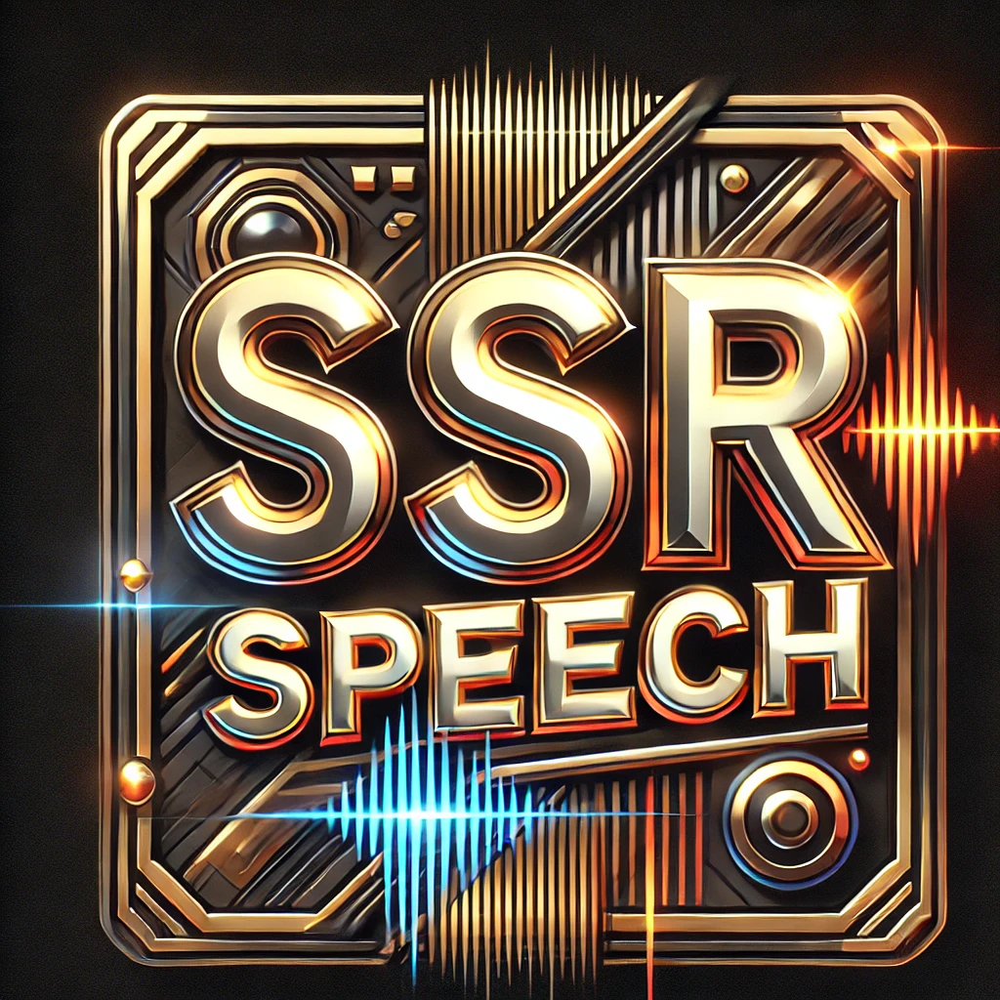

<p align="center">
  
</p>


<!-- [](https://arxiv.org/pdf/2409.07556)  [](https://huggingface.co/spaces/) [](https://huggingface.co/westbrook/SSR-Speech-English)  [](https://colab.research.google.com/drive/1g4-Oqd1Fu9WfDFb-nicfxqsWIPvsGb91?usp=sharing)  [](https://wanghelin1997.github.io/SSR-Speech-Demo/) -->


[](https://arxiv.org/pdf/2409.07556)  [](https://huggingface.co/spaces/OpenSound/SSR-Speech) [](https://huggingface.co/westbrook/SSR-Speech-Mandarin) [](https://huggingface.co/westbrook/SSR-Speech-English)   [](https://wanghelin1997.github.io/SSR-Speech-Demo/)

Official Pytorch implementation of the ICASSP 2025 paper: SSR-Speech: Towards Stable, Safe and Robust Zero-shot Speech Editing and Synthesis.

:star: Work done during an internship at Tencent AI Lab

## TODO
- [x] Release English model weights
- [x] Release Mandarin model weights
- [x] HuggingFace Spaces demo
- [x] Fix gradio app
- [x] arxiv paper
- [x] WhisperX forced alignment
- [x] ASR for automatically transcipt the prompt for TTS
- [x] Simplify the inference stage
- [x] Manage data preparation
- [x] Fast speed caused by CFG


## Environment setup
```bash
conda create -n ssr python=3.9.16
conda activate ssr

pip install git+https://github.com/WangHelin1997/SSR-Speech.git#subdirectory=audiocraft
pip install xformers==0.0.22
pip install torchaudio torch
apt-get install ffmpeg
apt-get install espeak-ng
pip install tensorboard==2.16.2
pip install phonemizer==3.2.1
pip install datasets==2.16.0
pip install torchmetrics==0.11.1
pip install huggingface_hub==0.22.2

# only use for inference
pip install gradio==3.50.2
pip install nltk>=3.8.1
pip install openai-whisper>=20231117
pip install whisperx==3.1.5
pip install faster-whisper==1.0.1
pip install num2words==0.5.13
pip install opencc-python-reimplemented
pip install ctranslate2==4.4.0
```

### ⚠️ Note
Make sure to install the correct version of `espeak-ng` and `phonemizer`. We used `espeak-ng=1.52` under `Ubuntu 22.04`. Otherwise, the Mandarin model may not work.

If you are using `espeak-ng=1.51`, please change the phonemizer from `cmn` to `cmn-latn-pinyin`.

## Pretrained Models

Download our pretrained English models from [huggingface](https://huggingface.co/westbrook/SSR-Speech-English).
We provide an Watemark Encodec model, a pretrained English model on GigaSpeech XL set, and a pretrained Mandarin model on internal data (25,000 hours).

After downloading the files, put them under this repo, like:
```
SSR-Speech/
    -data/
    -demo/
    -pretrained_models/
    ....
```

<!-- ## Gradio
### Run in colab

[](https://colab.research.google.com/drive/1g4-Oqd1Fu9WfDFb-nicfxqsWIPvsGb91?usp=sharing)

### Run locally
After environment setup, run gradio server from terminal:
```bash
python gradio_app.py
```
It is ready to use on [default url](http://127.0.0.1:7860).

### How to use it
1. (optionally) Select models
2. Load models
3. Transcribe
4. Align
5. Run -->

## Inference examples

For English speech editing test, please run:

```bash
python inference_v2.py  \
    --seed 2024 \
    --cfg_stride 5 \
    --sub_amount 0.12 \
    --aug_text \
    --use_watermark \
    --language 'en' \
    --model_path "./pretrained_models/English.pth" \
    --codec_path "./pretrained_models/wmencodec.th" \
    --orig_audio "./demo/84_121550_000074_000000.wav" \
    --target_transcript "But when I saw the mirage of the lake in the distance, which the sense deceives, Lost not by distance any marks," \
    --temp_folder "./demo/temp" \
    --output_dir "./demo/generated_se" \
    --savename "84_121550_000074_00000" \
    --whisper_model_name "base.en"
```

For English zero-shot TTS test, please run:

```bash
python inference_v2.py  \
    --seed 2024 \
    --tts \
    --aug_text \
    --cfg_stride 5 \
    --use_watermark \
    --language 'en' \
    --model_path "./pretrained_models/English.pth" \
    --codec_path "./pretrained_models/wmencodec.th" \
    --orig_audio "./demo/5895_34622_000026_000002.wav" \
    --prompt_length 3 \
    --target_transcript "I cannot believe that the same model can also do text to speech synthesis too!" \
    --temp_folder "./demo/temp" \
    --output_dir "./demo/generated_tts" \
    --savename "5895_34622_000026_000002" \
    --whisper_model_name "base.en"
```

For Mandarin speech editing test, please run:

```bash
python inference_v2.py  \
    --seed 2024 \
    --sub_amount 0.12 \
    --cfg_stride 1 \
    --aug_text \
    --use_watermark \
    --language 'zh' \
    --model_path "./pretrained_models/Mandarin.pth" \
    --codec_path "./pretrained_models/wmencodec.th" \
    --orig_audio "./demo/aishell3_test.wav" \
    --target_transcript "食品价格以基本都在一万到两万之间" \
    --temp_folder "./demo/temp" \
    --output_dir "./demo/generated_se" \
    --savename "aishell3_test" \
    --whisper_model_name "base"
```

For Mandarin zero-shot TTS test, please run:

```bash
python inference_v2.py  \
    --seed 2024 \
    --tts \
    --aug_text \
    --cfg_stride 1 \
    --use_watermark \
    --language 'zh' \
    --model_path "./pretrained_models/Mandarin.pth" \
    --codec_path "./pretrained_models/wmencodec.th" \
    --orig_audio "./demo/aishell3_test.wav" \
    --prompt_length 3 \
    --target_transcript "我简直不敢相信同一个模型也可以进行文本到语音的生成" \
    --temp_folder "./demo/temp" \
    --output_dir "./demo/generated_tts" \
    --savename "aishell3_test" \
    --whisper_model_name "base"
```


## Training
To train an SSR-Speech model, you need to prepare the following parts:
1. Prepare a json file saving data in the following format (including utterances and their transcripts):
```
{
"segment_id": "audio1",
"wav": "/data/audio1.wav",
"trans": "I like SSR-Speech.",
}
{
"segment_id": "audio2",
"wav": "/data/audio2.wav",
"trans": "SSR-Speech can do both zero-shot speech editing and text-to-speech!",
}
...
```

2. Encode the utterances into codes using e.g. Encodec. Run:

```bash
export CUDA_VISIBLE_DEVICES=0
cd ./data
JSON_PATH='/data/test_gigaspeech.json' # change to your path
SAVE_DIR='/data/gigaspeech' # change to your path
ENCODEC_PATH='./pretrained_models/wmencodec.th' # change to your wmencodec path
DATA_NAME='gigaspeech' # change to yours
python encode.py \
--dataset_name ${DATA_NAME} \
--save_dir ${SAVE_DIR} \
--encodec_model_path ${ENCODEC_PATH} \
--json_path ${JSON_PATH} \
--start 0 \
--end 10000000
```
Here, `JSON_PATH` is the path where the json file was saved, `SAVE_DIR` is the path where the processed data will be saved, `ENCODEC_PATH` is the path of a pretrained encodec model and `DATA_NAME` is the saved name of the dataset. Here the `start` and `end` indexes are used for multi-gpu processing.

3. Convert transcripts into phoneme sequence. Run:

```bash
JSON_PATH='/data/test_gigaspeech.json' # change to your path
SAVE_DIR='/data/gigaspeech' # change to your path
DATA_NAME='gigaspeech' # change to yours
python phonemize.py \
--dataset_name ${DATA_NAME} \
--json_path ${JSON_PATH} \
--save_dir ${SAVE_DIR}
```
Add `language='cmn'` in Line 47 (`phonemize.py`) when you process Mandarin.

4. Prepare manifest (i.e. metadata). Run:

```bash
JSON_PATH='/data/test_gigaspeech.json' # change to your path
SAVE_DIR='/data/gigaspeech' # change to your path
DATA_NAME='gigaspeech' # change to yours
SAVENAME='test' # change to yours
python filemaker.py \
--dataset_name ${DATA_NAME} \
--json_path ${JSON_PATH} \
--save_dir ${SAVE_DIR} \
--savename ${SAVENAME}
```

5. Prepare a phoneme set (we named it vocab.txt)

```bash
SAVE_DIR='/data/gigaspeech' # change to your path
DATA_NAME='gigaspeech' # change to yours
python vocab.py \
--dataset_name ${DATA_NAME} \
--save_dir ${SAVE_DIR}
```


Now, you are good to start training!

```bash
cd ./z_scripts
bash e830M.sh
```

If your dataset introduce new phonemes (which is very likely) that doesn't exist in the giga checkpoint, make sure you combine the original phonemes with the phoneme from your data when construction vocab. And you need to adjust `--text_vocab_size` and `--text_pad_token` so that the former is bigger than or equal to you vocab size, and the latter has the same value as `--text_vocab_size` (i.e. `--text_pad_token` is always the last token). From our experience, you can set `--text_vocab_size` to `100` for an English model and `200` for a Mandarin model.


## Training WaterMarking Encodec

To train the Watermarking Encodec, you need to:

1. install our audiocraft package,

```bash
cd ./audiocraft
pip install -e .
```

2. prepare data (for training, validataion and test), e.g.

```bash
python makefile.py
```

3. change the settings in `./audiocraft/config/` to your own and start training,

```bash
dora run -d solver='compression/encodec_audiogen_16khz' dset='internal/sounds_16khz'
```

## License
The codebase is under [MIT LICENSE](./LICENSE). Note that we use some of the code from other repository that are under different licenses: `./models/modules`, `./steps/optim.py`, `data/tokenizer.py` are under Apache License, Version 2.0; the phonemizer we used is under GNU 3.0 License.


## Acknowledgement
We thank Puyuan for his [VoiceCraft](https://github.com/jasonppy/VoiceCraft).


## Citation
```
@article{wang2024ssrspeech,
  author    = {Wang, Helin and Yu, Meng and Hai, Jiarui and Chen, Chen and Hu, Yuchen and Chen, Rilin and Dehak, Najim and Yu, Dong},
  title     = {SSR-Speech: Towards Stable, Safe and Robust Zero-shot Text-based Speech Editing and Synthesis},
  journal   = {arXiv},
  year      = {2024},
}
```
